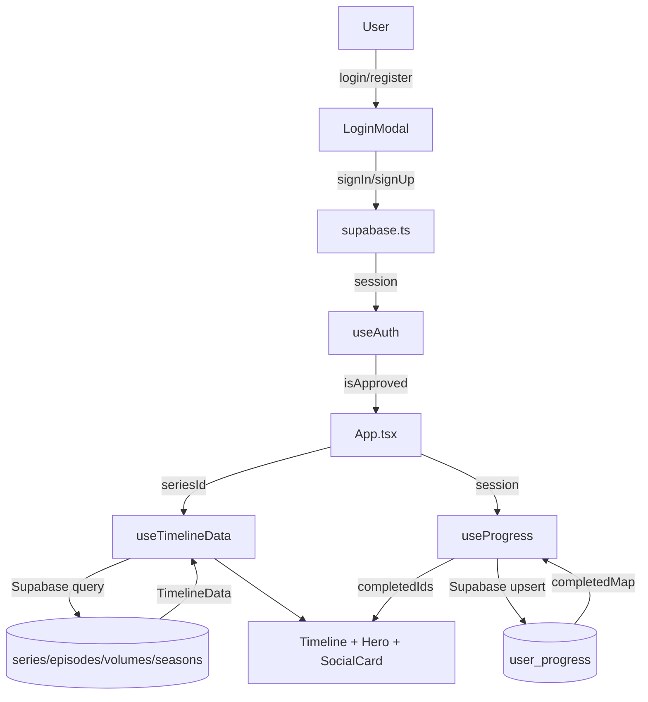
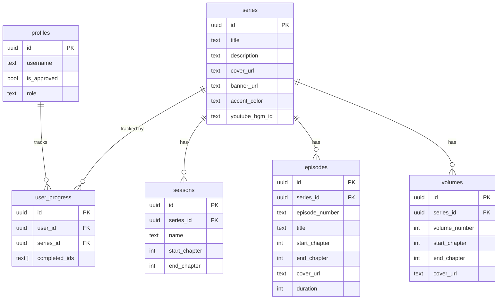
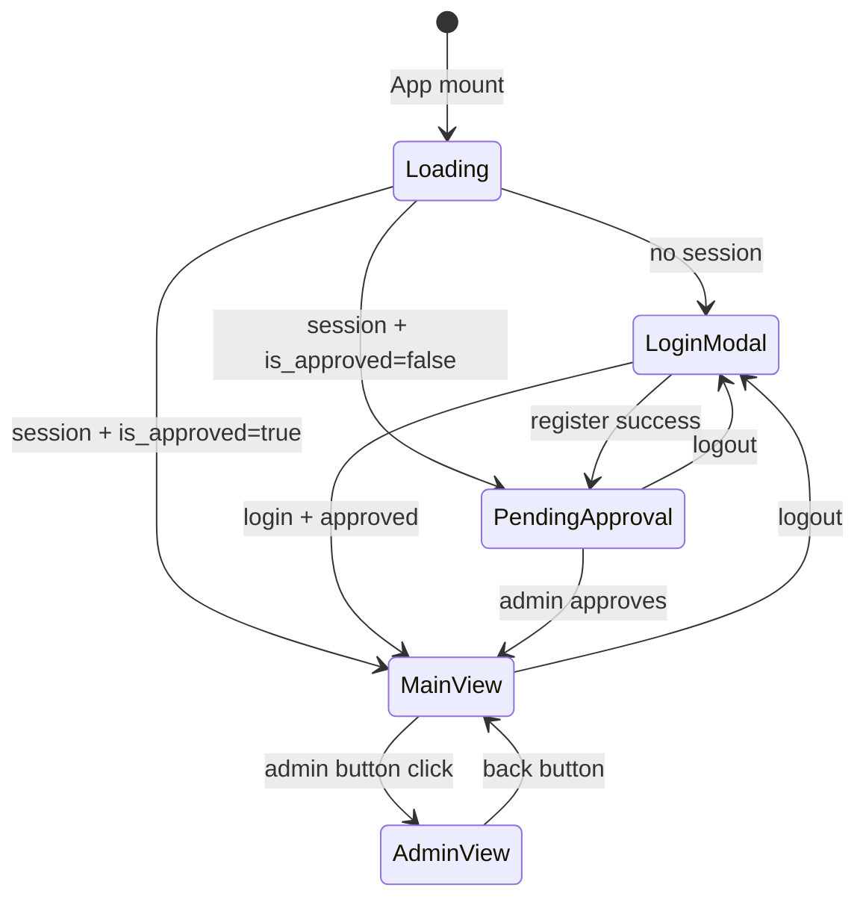

# AniMan Timeline Tracker

An anime/manga progress tracker that maps anime episodes to their source manga chapter ranges on an interactive timeline. Users can track which episodes they've watched and which manga volumes they've read, with real-time sync to a Supabase backend.

---

## Architecture Overview

```
src/
├── App.tsx                    # Root component — routing between main/admin views
├── components/
│   ├── Header.tsx             # Sticky navigation bar with series selector and search
│   ├── Hero.tsx               # Full-width series hero with progress bars and BGM player
│   ├── Timeline.tsx           # Interactive episode ↔ volume timeline (PC + mobile)
│   ├── TimelineNode.tsx       # Individual draggable timeline item (accessible)
│   ├── SocialCard.tsx         # Instagram-story-sized shareable progress card
│   ├── LoginModal.tsx         # Auth modal (login / register / pending-approval states)
│   ├── SearchBar.tsx          # Controlled search input for series filtering
│   ├── AdminDashboard.tsx     # Password-gated admin panel for adding content
│   └── ErrorBoundary/         # React class-based error boundary (prevents WSOD)
├── hooks/
│   ├── useAuth.ts             # Supabase auth state, session persistence, approval flow
│   ├── useProgress.ts         # Per-series completion tracking with Supabase sync
│   ├── useTimelineData.ts     # Fetches series detail + list from Supabase
│   ├── useHoverMapping.ts     # Cross-media chapter-range overlap highlighting
│   └── useAccentColor.ts      # Sets --accent-color CSS variable (utility)
├── lib/
│   ├── supabase.ts            # Supabase client singleton + auth/admin helpers
│   └── mockData.ts            # Static reference data (not used in production)
└── types/
    └── index.ts               # All shared TypeScript interfaces and types
```

### Data Flow



### Database Schema



### State Management Flow



---

## Setup

### Prerequisites

- Node.js 18+
- A Supabase project (free tier is sufficient)

### Local Development

```bash
# 1. Clone and install
npm install

# 2. Configure environment
cp .env.example .env
# Edit .env and set VITE_SUPABASE_URL and VITE_SUPABASE_ANON_KEY

# 3. Run migrations
# Apply the SQL files in supabase/migrations/ via the Supabase dashboard
# or Supabase CLI: supabase db push

# 4. Start dev server
npm run dev
```

### Environment Variables

| Variable | Description |
|---|---|
| `VITE_SUPABASE_URL` | Your Supabase project URL |
| `VITE_SUPABASE_ANON_KEY` | Supabase anon (public) key |
| `VITE_ADMIN_PASSWORD` | Optional local admin dashboard password |

### First Admin User

After the first user registers, you need to manually approve them and set their role to `admin` via the Supabase dashboard:

```sql
UPDATE profiles SET is_approved = true, role = 'admin' WHERE username = 'your_username';
```

---

## Deployment

```bash
# Build for production
npm run build

# Preview the build locally
npm run preview
```

Deploy the `dist/` folder to any static hosting provider (Vercel, Netlify, Cloudflare Pages, etc.).

---

## E2E Testing

This project uses [Playwright](https://playwright.dev/) for end-to-end tests.

```bash
# Install browser binaries (first time only)
npx playwright install

# Run all tests (requires dev server running)
npx playwright test

# Run tests with UI
npx playwright test --ui

# Run only auth tests
npx playwright test e2e/auth.spec.ts
```

For tests that require an authenticated session, set environment variables:

```bash
E2E_USERNAME=your_approved_username E2E_PASSWORD=your_password npx playwright test
```

---

## Key Design Decisions

- **Username-based auth**: Supabase requires email addresses, so usernames are stored as `{username}@animan.local` internally. This is transparent to users.
- **Approval gating**: New registrations start with `is_approved = false`. An admin must flip this via the database. This prevents unwanted signups on a private tracker.
- **Chapter-range mapping**: Instead of a separate mapping table, episodes and volumes store `start_chapter` / `end_chapter`. Overlap detection is done in-memory by `useHoverMapping`, which is fast enough for typical series sizes.
- **Admin role enforcement**: RLS policies use a `is_admin()` helper function that checks `profiles.role = 'admin'`, so the admin dashboard password is a UX convenience only — database writes are always server-side enforced.
